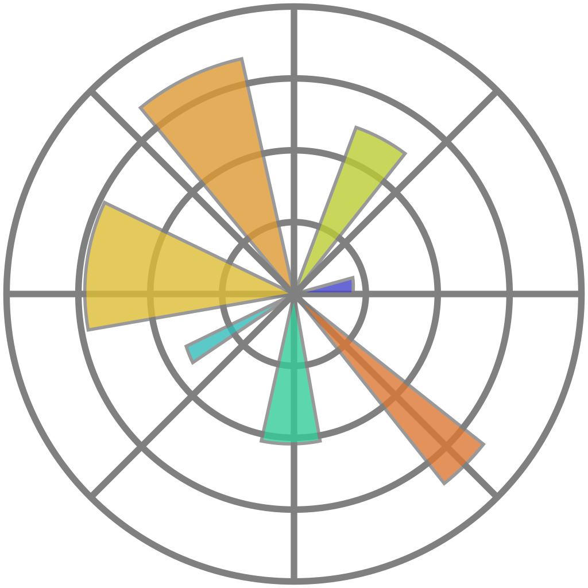
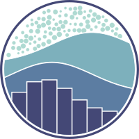

<h1> Hi, I'm Mikhail Zarembo!👋 </h1>

###
<h3 align="left"> 💻 Tools:</h3>

###

  
  
  
  
  
  
  
  
  
  
  
  
  
  
  

  
  
  
  
  
  
  
  

  <!---
  
  
  
  
  
  
  
  
  
  
  --->

###
<h3 align="left"> 🚀 I’m currently working on </h3>

###

